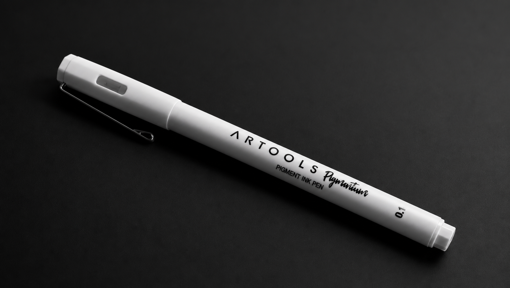

<div align="center">

# ARTOOLS — Experiência digital de produto

Projeto de estudo desenvolvido em **Astro** para apresentar uma caneta de precisão por meio de uma experiência visual responsiva, componentizada e interativa.

[](https://astro.build/)


### [Acessar demonstração na Vercel →](https://site-caneta-chi.vercel.app)

[Início](https://site-caneta-chi.vercel.app/) · [Catálogo](https://site-caneta-chi.vercel.app/catalogo/) · [Detalhes do produto](https://site-caneta-chi.vercel.app/produtos/6061-pearl/)

</div>



## Visão geral

ARTOOLS é um site fictício de apresentação e catálogo de canetas premium. O projeto começou como um exercício de landing page e evoluiu para uma experiência completa com página inicial, catálogo e rotas individuais para nove produtos, além de componentes reutilizáveis e interações desenvolvidas no front-end.

Sou estudante iniciante do curso de **Análise e Desenvolvimento de Sistemas** e conduzi este projeto para praticar a transformação de uma ideia em uma experiência publicada, usando IA como principal ferramenta de apoio durante o desenvolvimento.

## Uso de inteligência artificial

Este projeto foi desenvolvido **quase integralmente com assistência de IA generativa**, principalmente por meio do OpenAI Codex. A IA apoiou a geração e refatoração do código, a criação dos estilos, a componentização, a depuração, a documentação e a produção das imagens do catálogo.

Não apresento este repositório como código escrito integralmente à mão. Ele registra um processo de aprendizado assistido, no qual pratiquei como definir requisitos, analisar resultados, solicitar correções, validar funcionalidades e acompanhar um projeto até a publicação.

## Meu papel no processo

Minha participação concentrou-se em:

- Definir o objetivo, o conteúdo e as funcionalidades do site;
- Selecionar referências visuais e orientar o padrão de design;
- Dividir o projeto em página inicial, catálogo e detalhes do produto;
- Avaliar cada versão e identificar problemas de layout, navegação e usabilidade;
- Solicitar ajustes incrementais e comparar os resultados com as referências;
- Validar as páginas no navegador e acompanhar builds do Astro;
- Organizar a apresentação profissional do repositório;
- Acompanhar alterações, commits e versões publicadas no GitHub;
- Verificar a publicação automática do projeto na Vercel após cada atualização.

Como parte do estudo, meu objetivo é compreender e conseguir explicar os principais componentes, estilos, scripts e decisões presentes no projeto, mesmo quando a primeira implementação foi sugerida pela IA.

## Projeto em números

| Entrega | Resultado |
| --- | --- |
| Rotas de conteúdo publicadas | 11 |
| Produtos no catálogo | 9 |
| Componentes principais reutilizáveis | 7 |
| Layout compartilhado | 1 |
| Ambientes disponíveis | Desenvolvimento e produção |

## Funcionalidades

### Página inicial

- Apresentação imersiva do produto;
- Vídeo sincronizado com a rolagem;
- Seções editoriais com animações de entrada;
- Cards com microinterações;
- Marquee contínuo e ficha técnica;
- Navegação responsiva para as demais páginas.

### Catálogo

- Grade responsiva com nove produtos;
- Cards gerados por um componente reutilizável;
- Imagem, nome, descrição e especificação de cada modelo;
- Botões que direcionam para a rota individual de cada produto.

### Detalhes dos produtos

- Galeria com miniaturas selecionáveis;
- Informações de preço, acabamento e especificações;
- Seleção visual de modelos;
- Modal de interesse aberto pelo botão “Avise-me”;
- Formulário com validação nativa e confirmação visual.

## Tecnologias e ferramentas

| Tecnologia | Aplicação no projeto |
| --- | --- |
| **Astro 7** | Páginas, layouts, componentes e geração do site estático |
| **HTML5** | Estrutura semântica, navegação, mídia e formulários |
| **CSS3** | Grid, Flexbox, responsividade, animações e identidade visual |
| **JavaScript / TypeScript** | Galeria, modal, formulário e interações com rolagem e ponteiro |
| **Web APIs** | `IntersectionObserver`, `requestAnimationFrame`, `matchMedia` e `<dialog>` |
| **Node.js e npm** | Ambiente de desenvolvimento e gerenciamento de dependências |
| **Git e GitHub** | Versionamento e publicação do código-fonte |
| **Vercel** | Build e hospedagem da versão pública |
| **OpenAI Codex** | Apoio intensivo na geração, revisão, depuração e documentação do projeto |

## Prática com Git e GitHub

Este repositório também foi utilizado para praticar um fluxo básico de versionamento durante a evolução do projeto. Em vez de manter apenas uma entrega final, as mudanças foram registradas conforme novas páginas, componentes, correções responsivas e otimizações foram concluídas.

Práticas exercitadas neste projeto:

- Manutenção do código-fonte em um repositório remoto no GitHub;
- Organização das alterações em commits incrementais;
- Uso de mensagens de commit curtas e relacionadas ao que foi modificado;
- Consulta do histórico para acompanhar a evolução do site;
- Sincronização da branch principal com a versão publicada;
- Integração entre GitHub e Vercel para novos deploys após atualizações;
- Verificação do build e da versão pública antes de considerar uma alteração concluída.

Como estudante, ainda estou desenvolvendo autonomia com Git. Este projeto registra uma experiência prática com conceitos de repositório, histórico, commit, branch principal e publicação contínua, conduzida com apoio do OpenAI Codex.

[Consultar o histórico de commits →](https://github.com/tiagolaitharth/site_caneta/commits/main/)

## Organização do código

```text
src/
├── components/
│   ├── Button.astro
│   ├── Footer.astro
│   ├── Header.astro
│   ├── PenMarquee.astro
│   ├── ProductCard.astro
│   ├── StoryFeatureCard.astro
│   └── TechnicalSpecs.astro
├── layouts/
│   └── Layout.astro
├── data/
│   └── products.ts
└── pages/
    ├── index.astro
    ├── catalogo.astro
    └── produtos/
        └── [slug].astro
```

O `Layout.astro` concentra a estrutura comum do documento. O cabeçalho e o rodapé são compartilhados entre as páginas, enquanto cards e botões recebem conteúdo por propriedades para reduzir repetição de marcação.

## Desafios e soluções

| Desafio | Solução aplicada |
| --- | --- |
| Sincronizar vídeo e rolagem sem bloquear a interface | Atualização dos quadros com `requestAnimationFrame` e controle progressivo do tempo do vídeo |
| Manter o mesmo padrão visual em todas as rotas | Criação de `Layout`, cabeçalho, rodapé e botões compartilhados |
| Evitar repetição nos nove produtos do catálogo | Componente `ProductCard.astro` alimentado pela fonte central `products.ts` |
| Exibir produtos completos em diferentes telas | Grid responsivo, proporção controlada e imagens com `object-fit` adequado |
| Organizar URLs legíveis e indicar a seção atual | Rotas semânticas, páginas dinâmicas com `[slug].astro` e estado ativo obtido por `Astro.url.pathname` |
| Oferecer animações com mais acessibilidade | Alternativa para usuários com `prefers-reduced-motion` e foco visível nos controles |
| Melhorar o carregamento em celulares | MP4 preparado para reprodução progressiva e imagens processadas com `astro:assets` |

## Competências praticadas

- Desenvolvimento front-end;
- Construção de interfaces responsivas;
- Componentização com Astro;
- Organização e manutenção de CSS;
- Manipulação do DOM;
- Animações e microinterações;
- Navegação entre páginas;
- Versionamento de código com Git e GitHub;
- Organização de mudanças em commits descritivos e incrementais;
- Acompanhamento da branch principal e do histórico do projeto;
- Deploy contínuo com integração entre GitHub e Vercel;
- Definição de requisitos e condução iterativa com IA generativa;
- Avaliação crítica e refinamento de resultados produzidos por IA.

## Status e limitações

O projeto está publicado e disponível para navegação. A experiência visual e as interações principais estão funcionais.

O formulário “Avise-me” representa o fluxo de interface e realiza validação no navegador. Os dados ainda não são enviados para uma API ou banco de dados. Os produtos, a marca e os valores apresentados são fictícios e foram criados exclusivamente para estudo.

## Próximas melhorias

- Integrar o formulário a uma API e banco de dados;
- Adicionar máscara e validação aprimorada ao telefone;
- Medir e acompanhar as métricas de carregamento com Lighthouse;
- Adicionar testes de interface e acessibilidade;
- Implementar monitoramento de desempenho e navegação.

## Sobre mim

Sou estudante do curso de **Análise e Desenvolvimento de Sistemas**, em início de carreira. Utilizo projetos práticos e ferramentas de IA para transformar o conteúdo estudado em experiências funcionais e fortalecer meus conhecimentos em desenvolvimento web.

Este projeto demonstra minha capacidade de conduzir uma ideia até uma versão publicada, aprender por meio de iterações e usar IA com transparência. Também indica os pontos técnicos que continuo estudando para ampliar minha autonomia no desenvolvimento.
